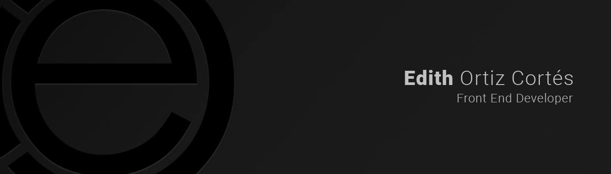

### Hi there 👋

 

I'm a Front End developer and graphic designer from Mexico.

**About me**

- 💼 Front End Developer for 2 years 11 months at [Toroto](https://toroto.com/)

- ❤️ I love writing Javascript, html, css, and building fun experiments

- 👨‍💻 I studied front end development at Laboratoria Coding and Coderhouse.

- 💬 Ask me about anything [here](https://github.com/EdithOrt/EdithOrt/issues)

**Laguages and tools**

<code></code>
<code></code>
<code></code>
<code></code>
<code></code>
<code></code>
<code></code>
<code></code>
<code></code>
<code></code>
<code></code>
<code></code>
<code></code>
<code></code>
<code></code>
<code></code>
<code></code>
<code></code>
<code></code>
<code></code>
<code></code>
<code></code>

| |  |
| -------------------------------------------------------------------------------------------------------------------------------------------------------------------------------------------------------------------------------------------------------------------- | ---------------------------------------------------------------------------------------------------------------------------------------------------------------------------------------------------------------------- |

#### Top Repositories

 
 

<!--
**EdithOrt/EdithOrt** is a ✨ _special_ ✨ repository because its `README.md` (this file) appears on your GitHub profile.

Here are some ideas to get you started:

- 🔭 I’m currently working on ...
- 🌱 I’m currently learning ...
- 👯 I’m looking to collaborate on ...
- 🤔 I’m looking for help with ...
- 💬 Ask me about ...
- 📫 How to reach me: ...
- 😄 Pronouns: ...
- ⚡ Fun fact: ...
-->
